```mermaid
graph LR
    A[🔄 Solidity Refresh] --> B[🎯 Attack Patterns]
    B --> C[🛠️ Tooling & Fuzzing]
    C --> D[🏆 Bug Bounties]
    D --> E[🦀 Rust & Solana]
    E --> F[⚡ Elite Auditor]

    style A fill:#00D9FF,stroke:#00D9FF,stroke-width:2px,color:#000
    style B fill:#FF6B6B,stroke:#FF6B6B,stroke-width:2px,color:#000
    style C fill:#4ECDC4,stroke:#4ECDC4,stroke-width:2px,color:#000
    style D fill:#95E1D3,stroke:#95E1D3,stroke-width:2px,color:#000
    style E fill:#AA96DA,stroke:#AA96DA,stroke-width:2px,color:#000
    style F fill:#FCBAD3,stroke:#FCBAD3,stroke-width:2px,color:#000
```

<div align="center">


<h2>
  
</h2>

<p align="center">
  
  
  
</p>

<p align="center">
  <a href="https://github.com/sum1t-here">
    
  </a>
  <a href="https://linkedin.com/sum1t-here">
    
  </a>
  <a href="mailto:mazumdarsumit3@gmail.com">
    
  </a>
  <a href="https://github.com/sum1t-here/solidity-security-portfolio">
    
  </a>
</p>


</div>

---


##  About Me

```typescript
const sumit = {
    pronouns: "He" | "Him",
    location: "India 🇮🇳",
    role: "Web3 Security Researcher & Full Stack Dev",

    currentFocus: [
        "Smart Contract Auditing 🔐",
        "EVM Internals & Attack Patterns 🧠",
        "Rust for Systems & Solana Security 🦀",
        "Bug Bounties on Immunefi & CodeHawks 🏆"
    ],

    security: {
        languages:   ["Solidity", "Rust", "Yul"],
        tools:       ["Foundry", "Slither", "Echidna", "Medusa"],
        platforms:   ["Immunefi", "CodeHawks", "Code4rena", "Cantina"],
        ctf:         ["Ethernaut", "Damn Vulnerable DeFi"],
    },

    web2Stack: {
        frontEnd:  ["React", "Next.js", "TypeScript", "Tailwind"],
        backEnd:   ["Node.js", "Express", "FastAPI"],
        databases: ["MongoDB", "PostgreSQL", "Redis"],
        devOps:    ["Docker", "GitHub Actions", "Linux"]
    },

    motto: "Break it before someone else does 💀"
};
```


---

##  Tech Stack

<div align="center">

### 🔐 Security & Blockchain

<br/>


### 🎨 Frontend


### ⚙️ Backend


### 🗄️ Databases & DevOps


</div>


---

##  Security Journey

<div align="center">



</div>


---

##  What I'm Up To

<table>
  <tr>
    <td align="center" width="50%">
      
      <h3>🔐 Currently Working On</h3>
      <p align="left">
        • Smart contract security auditing<br/>
        • ERC-20 & Vault contracts from scratch<br/>
        • Foundry testing & fuzzing<br/>
        • Learning EVM internals deeply<br/>
        • Ethernaut & Damn Vulnerable DeFi CTFs
      </p>
    </td>
    <td align="center" width="50%">
      
      <h3>📚 Currently Learning</h3>
      <p align="left">
        • Smart contract vulnerability patterns<br/>
        • Rust fundamentals for systems security<br/>
        • Slither static analysis<br/>
        • Echidna property-based fuzzing<br/>
        • Professional audit report writing
      </p>
    </td>
  </tr>
</table>


---

##  Skills & Proficiency

```text
Smart Contract Security  ████████░░░░░░░░░░░░░░   Growing 🔄
Solidity                 ████████████████░░░░░░   75%
Rust                     ████░░░░░░░░░░░░░░░░░░   Learning 🦀
EVM Internals            ██████░░░░░░░░░░░░░░░░   30%
Foundry & Testing        ████████████░░░░░░░░░░   55%
Frontend Development     ████████████████████░░   90%
Backend Development      ████████████████░░░░░░   80%
Problem Solving          ██████████████████░░░░   85%
```


---

##  Latest Blog Posts

<div align="center">
<table>
  <tr>
    <td width="50%" valign="top">
      
      <h3>📝 Recent Articles</h3>

<!-- BLOG-POST-LIST:START -->
[React Hooks Deep Dive](https://medium.com/@mazumdarsumit3/i-was-writing-react-wrong-for-8-months-00557bf573a0)
<!-- BLOG-POST-LIST:END -->

<br/>
<a href="https://medium.com/@mazumdarsumit3">
  
</a>
<a href="https://sum1there.hashnode.dev">
  
</a>
    </td>
    <td width="50%" valign="top">
      
      <h3>📚 Topics I Write About</h3>

```yaml
Security:
  - Smart Contract Vulnerabilities
  - EVM Internals & Attack Patterns
  - Audit Report Walkthroughs
  - CTF Solutions & Writeups
  - Rust & Solana Security

Web Dev:
  - React & Next.js
  - TypeScript Patterns
  - Backend Architecture
```

<a href="https://sum1there.hashnode.dev">
  
</a>
    </td>
  </tr>
</table>
</div>


---

##  GitHub Stats

<div align="center">
  
</div>


---

##  Contribution Graph

<div align="center">
  <picture>
    <source media="(prefers-color-scheme: dark)" srcset="https://raw.githubusercontent.com/sum1t-here/sum1t-here/output/github-contribution-grid-snake-dark.svg">
    <source media="(prefers-color-scheme: light)" srcset="https://raw.githubusercontent.com/sum1t-here/sum1t-here/output/github-contribution-grid-snake.svg">
    
  </picture>
</div>


---

##  Random Dev Quote

<div align="center">

</div>


---

##  Connect With Me

<div align="center">

<a href="https://github.com/sum1t-here">
  
</a>
<a href="https://linkedin.com/sum1t-here">
  
</a>
<a href="https://twitter.com/sum1t_here">
  
</a>
<a href="mailto:mazumdarsumit3@gmail.com">
  
</a>
<a href="https://github.com/sum1t-here/solidity-security-portfolio">
  
</a>

<br><br>


### 💖 Support My Work

<a href="https://www.buymeacoffee.com/sum1there">
  
</a>

</div>


---

<div align="center">


```
╔══════════════════════════════════════════════════════════════╗
║                                                              ║
║   Breaking contracts before hackers do. 🔐🚀                 ║
║                                                              ║
╚══════════════════════════════════════════════════════════════╝
```


</div>
