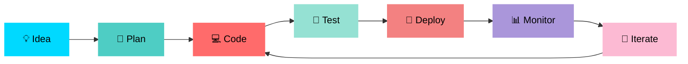

<div align="center">

<!-- ═══════════════════════════════════════════════════════════════ -->
<!--                    ANIMATED HEADER SECTION                      -->
<!-- ═══════════════════════════════════════════════════════════════ -->


<h2>
  
</h2>

<p align="center">
  
  
  
</p>

<p align="center">
  <a href="https://github.com/sum1t-here">
    
  </a>
  <a href="https://linkedin.com/sum1t-here">
    
  </a>
  <a href="mailto:mazumdarsumit3@gmail.com">
    
  </a>
  <a href="https://github.com/sum1t-here">
    
  </a>
</p>


</div>

---

<!-- ═══════════════════════════════════════════════════════════════ -->
<!--                      ANIMATED ABOUT SECTION                     -->
<!-- ═══════════════════════════════════════════════════════════════ -->


##  About Me

```typescript
const sumit = {
    pronouns: "He" | "Him",
    location: "India 🇮🇳",
    role: "Full Stack Developer",
    
    code: ["TypeScript", "JavaScript", "Python", "HTML", "CSS"],
    technologies: {
        frontEnd: {
            js: ["React", "Next.js"],
            css: ["Tailwind", "Bootstrap", "Sass"]
        },
        backEnd: {
            js: ["Node.js", "Express"],
            python: ["FastAPI"]
        },
        databases: ["MongoDB", "PostgreSQL", "Redis"],
        devOps: ["Docker", "GitHub Actions", "Linux"],
        tools: ["Git", "VS Code", "Postman", "Figma"]
    },
    
    currentFocus: "Building scalable & user-friendly applications",
    funFact: "I debug with console.log() and I'm not ashamed! 😄"
};
```


---

<!-- ═══════════════════════════════════════════════════════════════ -->
<!--                    TECH STACK WITH ICONS                        -->
<!-- ═══════════════════════════════════════════════════════════════ -->

##  Tech Stack

<div align="center">

### 🎨 Frontend


### ⚙️ Backend


### 🗄️ Databases & Tools


### 🛠️ DevOps & Others


</div>


---

<!-- ═══════════════════════════════════════════════════════════════ -->
<!--                      LATEST BLOG POSTS                          -->
<!-- ═══════════════════════════════════════════════════════════════ -->
 Latest Blog Posts
<div align="center">
<table>
  <tr>
    <td width="50%" valign="top">
      
      <h3>📝 Recent Articles</h3>
<!-- BLOG-POST-LIST:START -->
[React Hooks Deep Dive](https://medium.com/@mazumdarsumit3/i-was-writing-react-wrong-for-8-months-00557bf573a0)

      
<!-- BLOG-POST-LIST:END -->
<br/>
<a href="https://medium.com/@mazumdarsumit3">
  
</a>
</td>
<td width="50%" valign="top">
  
  <h3>📚 Topics I Write About</h3>
yamlCategories:
  - Web Development
  - JavaScript & TypeScript
  - React & Next.js
  - Backend Architecture
  - Database Design
  - DevOps & Cloud
  - Best Practices
  - Code Tutorials
  
Writing Style:
  - Beginner Friendly
  - Code Examples
  - Real-world Projects
  - Tips & Tricks
<br/>
<a href="https://sum1there.hashnode.dev">
  
</a>
</td>
  </tr>
</table>
</div>
<div align="center">

---

<!-- ═══════════════════════════════════════════════════════════════ -->
<!--                    GITHUB STATS WITH TROPHIES                   -->
<!-- ═══════════════════════════════════════════════════════════════ -->

##  GitHub Stats

<div align="center">
  
  
  
</div>

<div align="center">
  
  
</div>

<div align="center">
  
  
</div>

<div align="center">
  
</div>


---

<!-- ═══════════════════════════════════════════════════════════════ -->
<!--                    CONTRIBUTION SNAKE ANIMATION                 -->
<!-- ═══════════════════════════════════════════════════════════════ -->

##  Contribution Graph

<div align="center">
  <picture>
    <source media="(prefers-color-scheme: dark)" srcset="https://raw.githubusercontent.com/sum1t-here/sum1t-here/output/github-contribution-grid-snake-dark.svg">
    <source media="(prefers-color-scheme: light)" srcset="https://raw.githubusercontent.com/sum1t-here/sum1t-here/output/github-contribution-grid-snake.svg">
    
  </picture>
</div>


---

<!-- ═══════════════════════════════════════════════════════════════ -->
<!--                      SKILLS PROGRESS BARS                       -->
<!-- ═══════════════════════════════════════════════════════════════ -->

##  Skills & Proficiency

```text
Frontend Development   ████████████████████░░   90%
Backend Development    ████████████████░░░░░░   80%
Database Management    ███████████████░░░░░░░   75%
DevOps & Cloud        █████████████░░░░░░░░░   65%
UI/UX Design          ████████████░░░░░░░░░░   60%
Problem Solving       ██████████████████░░░░   85%
```


---

<!-- ═══════════════════════════════════════════════════════════════ -->
<!--                      CURRENT FOCUS SECTION                      -->
<!-- ═══════════════════════════════════════════════════════════════ -->

##  What I'm Up To

<table>
  <tr>
    <td align="center" width="50%">
      
      <h3>🚀 Currently Working On</h3>
      <p align="left">
        • Building full-stack web applications<br/>
        • Learning system design patterns<br/>
        • Contributing to open source<br/>
        • Exploring cloud technologies
      </p>
    </td>
    <td align="center" width="50%">
      
      <h3>📚 Currently Learning</h3>
      <p align="left">
        • Advanced TypeScript patterns<br/>
        • Microservices architecture<br/>
        • Kubernetes & Docker<br/>
        • AWS Cloud Services
      </p>
    </td>
  </tr>
</table>


---

<!-- ═══════════════════════════════════════════════════════════════ -->
<!--                      ANIMATED WORK PROCESS                      -->
<!-- ═══════════════════════════════════════════════════════════════ -->

##  My Development Process

<div align="center">



</div>


---

<!-- ═══════════════════════════════════════════════════════════════ -->
<!--                      FUN FACTS SECTION                          -->
<!-- ═══════════════════════════════════════════════════════════════ -->

##  Random Dev Quote

<div align="center">


</div>


---

<!-- ═══════════════════════════════════════════════════════════════ -->
<!--                      CONNECT & SUPPORT                          -->
<!-- ═══════════════════════════════════════════════════════════════ -->

##  Connect With Me

<div align="center">

<a href="https://github.com/sum1t-here">
  
</a>
<a href="https://linkedin.com/sum1t-here"">
  
</a>
<a href="https://twitter.com/sum1t_here"">
  
</a>
<a href="mailto:mazumdarsumit3@gmail.com">
  
</a>
<a href="https://github.com/sum1t-here">
  
</a>

<br><br>


### 💖 Support My Work

<a href="https://www.buymeacoffee.com/sum1there">
  
</a>

</div>


---

<!-- ═══════════════════════════════════════════════════════════════ -->
<!--                      VISITOR COUNTER                            -->
<!-- ═══════════════════════════════════════════════════════════════ -->

<div align="center">

##  Profile Views


</div>

---

<!-- ═══════════════════════════════════════════════════════════════ -->
<!--                      FOOTER WITH ANIMATION                      -->
<!-- ═══════════════════════════════════════════════════════════════ -->

<div align="center">


### ⚡ *From [sum1t-here](https://github.com/sum1t-here) with* 💙

```
╔══════════════════════════════════════════════════════════════╗
║                                                              ║
║  Thanks for visiting! Happy Coding! 🚀                       ║
║                                                              ║
╚══════════════════════════════════════════════════════════════╝
```


</div>
